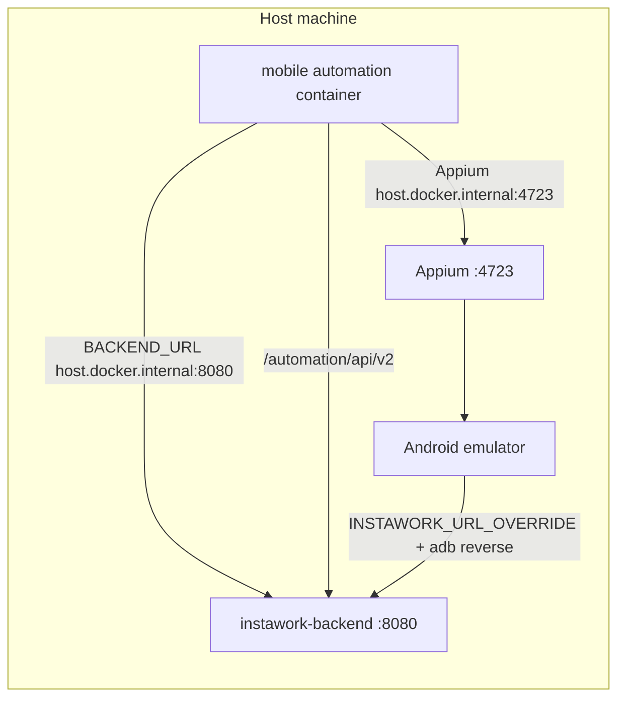

Use this when asked to run Instawork **mobile** automation against a **local backend on port 8080**, on a **local Android emulator**, inside the **Docker automation container**.

## Context

### Repos and roles

| Repo | Path | Role |
|------|------|------|
| Instawork | `instawork/` | Serves backend API, admin, and `/automation/api/v2` on **8080** via Docker |
| Mobile | `mobile/` | Applicant/business apps, Instatest framework, `.env`, Docker QA runner |

The mobile repo does **not** host the backend. Local tests assume the Instawork Docker stack is already up.

## What works

### Quick success checklist

Run these in order before starting Instatest:

1. **Instawork backend healthy** on the host:
   ```bash
   curl http://localhost:8080/internal/health_check
   ```
   Expect `{"healthy": true, ...}`. Container name is usually `instawork-backend`.

2. **Android emulator running** and matching `mobile/.env`:
   - `DEVICE_LOCAL_ANDROID_NAME` = AVD name from `emulator -list-avds` (e.g. `Android15`)
   - `DEVICE_LOCAL_ANDROID_VERSION` = release from `adb shell getprop ro.build.version.release` plus `.0` (e.g. `15.0`)

3. **Appium server on host** port 4723:
   ```bash
   appium server --base-path /wd/hub --address 0.0.0.0 --port 4723
   ```
   Verify: `curl http://127.0.0.1:4723/wd/hub/status`

4. **`adb reverse`** for the app on the emulator:
   ```bash
   adb reverse tcp:8080 tcp:8080
   ```
   Preflight (`check-local-device.sh`) runs this automatically when `BACKEND_URL` points at localhost / `host.docker.internal:8080`.

5. **Automation APK present**:
   `mobile/applicant-app/bin/applicant-automation.apk`

6. **`mobile/.env`** configured for local (see below).

7. **Docker automation image** built at least once:
   ```bash
   cd mobile && docker compose -f docker-compose_qa.yml build automation
   ```

### Local backend wiring (two URLs)

Mobile local runs need **two different URLs** for two different consumers:

| Variable | Example | Consumer |
|----------|---------|----------|
| `BACKEND_URL` | `http://host.docker.internal:8080` | Instatest preflight + API v2 calls from **inside** the Docker container |
| `INSTAWORK_URL_OVERRIDE` | `http://localhost:8080` | **Mobile app** on the emulator (via Appium intent arg `instaworkUrl`) |
| `BACKEND_INSTANCE` | `online` | Selects `test_data.json` profile where `backend_domain` is `http://localhost:8080` |

Also set in `mobile/.env`:

```bash
BACKEND_URL="http://host.docker.internal:8080"
INSTAWORK_URL_OVERRIDE="http://localhost:8080"
BACKEND_INSTANCE="online"
```

**Do not** point `BACKEND_URL` at `https://qa.instawork.com` when the user asked for localhost. Preflight may still pass against QA while the app hits the wrong environment.

`mobile/.env` is gitignored. Edit it locally; do not commit secrets.

#### Instawork side

Instawork `.env` should include:

```bash
IW_DOMAIN=http://localhost:8080
```

Start stack from `instawork/`:

```bash
docker compose up -d
just migrate          # if needed
just demodata --sync  # if tests need seeded data
```

### Canonical preflight (host)

From `mobile/`, match `.vscode/tasks.json` (`docker:debug:applicant:android`):

```bash
cd mobile
source .vscode/scripts/check-local-device.sh android "$(pwd)"
python3 .vscode/scripts/check_backend_url.py
.vscode/scripts/check-appium.sh
python3 .vscode/scripts/check_build_artifacts.py "$(pwd)" \
  --application docker_local_applicant-automation --driver local
```

All four must pass before running tests. If any fail, fix that layer only; do not skip preflight.

### Run command: applicant Android login (local)

Recommended scenario: **Successful Login** in `applicant-app/test/automation/features/applicant/pre_onboarding/login_part1.feature`.

```bash
cd mobile
docker compose -f docker-compose_qa.yml run --rm automation bash -lc '
cd /workspace/applicant-app/test/automation && \
export SKIP_BACKEND=$([ "$BACKEND_INSTANCE" = "online" ] && echo "0" || echo "1") && \
export SKIP_DATABASE=$([ "$BACKEND_INSTANCE" = "online" ] && echo "0" || echo "1") && \
python -u -m instatest run \
  -f features/applicant/pre_onboarding/login_part1.feature \
  -T "@login+@smoke+~@wip+~@broken" \
  --name "Successful Login" \
  --device-name "${DEVICE_LOCAL_ANDROID_NAME:-}" \
  --device-platform Android \
  --device-version "${DEVICE_LOCAL_ANDROID_VERSION:-}" \
  --backend-url "${BACKEND_URL:-}" \
  --application docker_local_applicant-automation \
  --driver local \
  --behave-args "+D test"
'
```

Notes:

- Run **`docker compose` from the host** in `mobile/`. Do **not** run `instatest` directly on the host for final validation.
- Use `python -u -m instatest run` (not `debugpy --wait-for-client`) for unattended runs.
- `@ios` on scenarios does **not** exclude Android. It is metadata; Android runs are valid.
- `docker-compose_qa.yml` exposes `host.docker.internal` so the container reaches host Appium (`4723`) and backend (`8080`).

### Architecture



## Gotchas

### Troubleshooting playbook

#### Appium not running

**Symptom:** `check-appium.sh` fails; curl to `:4723/wd/hub/status` fails.

**Fix:** Start Appium in a persistent background shell (not a one-shot that exits):

```bash
appium server --base-path /wd/hub --address 0.0.0.0 --port 4723
```

Wait until status returns `"ready": true`. Preflight uses `http://0.0.0.0:4723`; binding `--address 0.0.0.0` matters.

#### Backend health check fails

**Symptom:** `check_backend_url.py` fails.

**Fix:**

- Confirm Instawork containers: `docker ps | rg instawork-backend`
- Confirm host health: `curl http://localhost:8080/internal/health_check`
- For local runs, `BACKEND_URL` must be `http://host.docker.internal:8080` (no trailing slash)

#### "Login link is not visible" on home screen

**Symptom:** Step `I should be on the home screen` fails; earlier `the home screen should be loaded` may pass.

**Likely causes (check in this order):**

1. **Emulator unhealthy** (most common in practice)
   - UI dump shows `System UI isn't responding` or ANR dialog.
   - **Fix:** Cold boot emulator, do not reuse a wedged instance:
     ```bash
     export ANDROID_HOME="$HOME/Library/Android/sdk"
     "$ANDROID_HOME/emulator/emulator" -avd Android15 -no-snapshot-load -no-audio -no-boot-anim
     ```
   - Wait for boot: `adb shell getprop sys.boot_completed` → `1`
   - Re-run `adb reverse tcp:8080 tcp:8080`

2. **Wrong backend URL in `.env`**
   - App launches but cannot load intro screen content.
   - **Fix:** Set `INSTAWORK_URL_OVERRIDE=http://localhost:8080` and confirm reverse is active: `adb reverse --list`

3. **Missing adb reverse**
   - Log line: `Skipping adb reverse ... adb is not available` inside container is **expected** (no adb in container).
   - Reverse must be applied on the **host** before the run (preflight does this when configured correctly).

**Sanity check before re-running the full test:**

```bash
adb reverse tcp:8080 tcp:8080
adb install -r mobile/applicant-app/bin/applicant-automation.apk
adb shell am start -n com.instaworkmobile.automation/com.instaworkmobile.MainActivity \
  --es instaworkUrl "http://localhost:8080"
sleep 15
adb shell cat /sdcard/window_dump.xml | rg 'intro-screen/sign-in-button'
```

Expect `content-desc="intro-screen/sign-in-button"`. If missing, fix emulator/network before Docker/Instatest.

#### Emulator process dies silently within seconds of cold boot, no crash report

**Symptom:** `qemu-system-aarch64` process starts, appears in `ps`, then vanishes within 5-15s.
The emulator log just stops mid-startup (often right after "Activated packet streamer for
bluetooth emulation" or similar) with no error line, no `~/Library/Logs/DiagnosticReports`
crash report, and nothing in `log show` for the process. Retrying the exact same cold-boot
command reproduces the same silent death.

**Root cause:** host memory pressure, not an emulator bug. Check `vm_stat` (`Pages free` *
16384 bytes); if free physical memory is in the tens of MB (not GB) with a large compressor,
the emulator's initial memory allocation gets starved. macOS does not reliably log this kind of
soft OOM failure for a non-sandboxed helper process.

**Fix:** free a few GB before retrying, then cold-boot again (do not keep retrying at the same
memory level, it will keep dying at the same point):

```bash
vm_stat | head -5   # check free pages before and after
osascript -e 'quit app "Google Chrome"'   # or another memory-heavy, non-essential app
```

#### Background process (Appium, emulator, etc.) launched with `&`/`disown` dies when the shell tool call returns

**Symptom:** a command started as `some_server & disown` inside a shell-tool call appears to
start successfully (verified with a `curl`/`ps` check within the same call), but is gone by the
next tool call.

**Fix:** don't rely on `&`/`disown` for anything that must outlive a single tool invocation.
Launch it as its own tool-managed background job instead (e.g. by invoking the bare foreground
command with a backgrounding option set to 0/immediate, so the harness itself tracks and keeps
the process alive as a persistent job, rather than backgrounding it inside a shell that then
exits). Verify liveness with a fresh call afterward (`curl .../status`, `ps aux | rg <name>`).

#### Emulator disappears from `adb devices`

**Symptom:** `adb devices` empty after reboot/kill; qemu may still be running.

**Fix:**

```bash
adb kill-server && adb start-server
# wait up to 2 minutes for emulator to re-register
adb wait-for-device
```

If still missing, stop stale qemu and start a fresh AVD (see cold boot command above). Avoid `adb kill-server` while a test is mid-run.

#### Preflight passes against QA instead of localhost

**Symptom:** Backend check hits `https://qa.instawork.com` while user wanted local.

**Fix:** Update `mobile/.env` `BACKEND_URL` to `http://host.docker.internal:8080`. Re-source env or rely on docker-compose `env_file: .env`.

#### 0 scenarios run

**Symptom:** Exit 0 but nothing executed.

**Fix:** Tag filter too narrow. For login smoke use `-T "@login+@smoke+~@wip+~@broken"` or `--name "Successful Login"`. Inspect feature tags before running.

#### Test passes but API calls fail

**Symptom:** UI works; worker creation/deactivation errors in logs.

**Fix:** Ensure `BACKEND_INSTANCE=online` so `SKIP_BACKEND=0` and API client uses `http://localhost:8080/automation/api/v2`. Confirm Instawork migrations and demo data if endpoints return 5xx.

## Key file references

| File | Purpose |
|------|---------|
| `mobile/.env` | Local device names, backend URLs, run tags |
| `mobile/.env.example` | Template; localhost defaults documented here |
| `mobile/docker-compose_qa.yml` | Automation container, `host.docker.internal`, env_file |
| `mobile/.vscode/tasks.json` | Canonical preflight + run shape for applicant Android |
| `mobile/applicant-app/test/automation/configuration/test_data.json` | `online` → `http://localhost:8080` |
| `instawork/docker-compose.yml` | Backend on 8080, frontend on 8089 |
| `instawork/.env` | `IW_DOMAIN=http://localhost:8080` |

## Efficiency rules for agents

1. **Read `mobile/.env` first** before any run. Wrong `BACKEND_URL` causes long false starts.
2. **Verify Instawork backend** (`curl localhost:8080/internal/health_check`) before touching mobile tooling.
3. **Run all four preflight scripts** in one block; do not jump straight to Docker.
4. **If home screen assertion fails**, check emulator health with UI dump **before** changing test code or locators.
5. **Keep Appium running** in a background shell for the whole session; restarting mid-debug loses time.
6. **Do not commit `mobile/.env`**; it is gitignored and contains credentials.
7. **Prefer one feature file + `--name`** over broad tag runs when validating a single login scenario.

## Verified run (reference)

- **Date:** 2026-06-18
- **Scenario:** `Successful Login` (`login_part1.feature`)
- **Platform:** Android 15 emulator (`Android15` / `emulator-5554`)
- **Backend:** `instawork-backend` on `localhost:8080`
- **Result:** 16 steps passed, ~1m 38s
- **Blocker resolved:** System UI ANR on old emulator; cold boot fixed it

## Related

- [web e2e local](./web-e2e-local.md)
- [instawork automation API](../tooling/instawork-automation-api.md)
