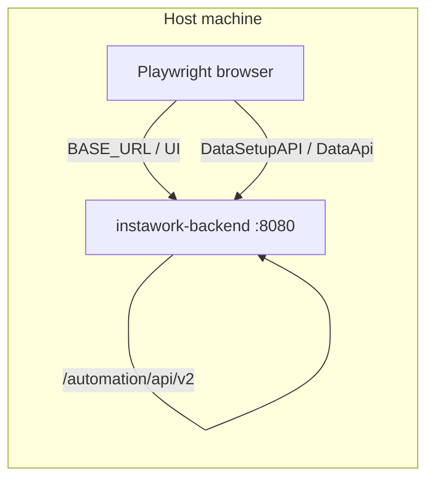

Use this when asked to run **web** end-to-end tests against `http://localhost:8080`.

## Context

### Repo and path

| What | Path |
|------|------|
| Test suite | `instawork/e2e/web/` |
| Playwright config | `instawork/e2e/web/playwright.config.ts` |
| Page actions (POM) | `instawork/e2e/web/pageActions/` |
| Test specs | `instawork/e2e/web/tests/` |
| Localhost signup smoke | `instawork/e2e/web/tests/localhost/signupSmoke.spec.ts` |
| Coding standards | `instawork/e2e/web/AGENTS.md` |

**Naming note:** Users may say "Instaborg"; the repo is **`instawork`**.

## What works

### Quick success checklist

Run in order before Playwright:

1. **Backend reachable on host:**
   ```bash
   curl -s -o /dev/null -w "%{http_code}" http://localhost:8080/
   ```
   Expect `200`.

2. **Automation API available** (required for signup/data setup tests):
   ```bash
   curl -s -o /dev/null -w "%{http_code}" http://localhost:8080/automation/api/v2/swagger
   ```
   Expect `200`. OpenAPI docs confirm the stack is automation-ready.

3. **Dependencies installed** (once per machine):
   ```bash
   cd instawork/e2e/web
   yarn install
   npx playwright install
   ```

4. **Override `BASE_URL` for local** — do not trust `e2e/web/.env` alone; it often points at a demo environment:
   ```bash
   BASE_URL=http://localhost:8080 npx playwright test ...
   ```
   Shell env wins over `.env` when set explicitly. Restart Playwright after changing `BASE_URL`.

### Canonical local run command

**Localhost signup smoke** (fastest path to verify web E2E + automation API):

```bash
cd instawork/e2e/web
BASE_URL=http://localhost:8080 PW_RETRIES=0 PW_WORKERS=1 \
  npx playwright test tests/localhost/signupSmoke.spec.ts --workers=1
```

**Any single spec on localhost:**

```bash
cd instawork/e2e/web
BASE_URL=http://localhost:8080 PW_RETRIES=0 PW_WORKERS=1 \
  npx playwright test tests/<path>.spec.ts --workers=1
```

Use `PW_WORKERS=1` for signup/onboarding flows to avoid constance-variable races. Use `PW_RETRIES=0` while debugging so failures are not masked.

### How local differs from QA/demo

| Area | QA / demo | Localhost (`:8080`) |
|------|-----------|---------------------|
| `BASE_URL` | `https://qa.instawork.com` or `https://demo-*.instawork.com` | `http://localhost:8080` |
| Automation API | Same host + `/automation/api/v2` | Same pattern |
| After "Book Instawork Pros" | Often shows **AI chat modal** first (`aiChatModal.ts`) | Usually **skips modal** and lands on staffing type page |
| Full `tests/signup.spec.ts` | Expects `AiChatModal.progressToBookingForm` | Fails on AI modal timeout; use `signupSmoke.spec.ts` or assert `BookingFormStaffingType` directly |
| Email verify links from API | May return production-like host | May return `http://0.0.0.0:8080/...` — still works via `page.request.get()` |
| Home `/` | Marketing landing | Often renders signup content; prefer explicit `/business/sign-up` in tests |

### Architecture (web local)



Playwright uses one `BASE_URL` for both browser navigation and automation API calls (`utils/dataSetupApi.ts` appends `/automation/api/v2`).

## Gotchas

### Automation API pitfalls (save time)

See [instawork automation API](../tooling/instawork-automation-api.md) for the shared details. Highlights:

1. **No trailing slashes.** Endpoints 404 with a trailing `/`:
   - Good: `/automation/api/v2/constance-variables/PARTNER_PHONE_VERIFICATION_REQUIRED`
   - Bad: `/automation/api/v2/constance-variables/PARTNER_PHONE_VERIFICATION_REQUIRED/`

2. **Preflight with curl before blaming Playwright:**
   ```bash
   curl -s http://localhost:8080/automation/api/v2/constance-variables/PARTNER_PHONE_VERIFICATION_REQUIRED
   curl -s -X POST http://localhost:8080/automation/api/v2/phone-verification/direct-verify \
     -H "Content-Type: application/json" -d '{"phone":"(502) 555-1234"}'
   ```
   Second call returns `{"error":"User not found"}` without a real user — that is expected. A **404 HTML page** means wrong URL or backend not automation-ready.

3. **`global-setup.ts`** calls `DataSetupAPI.createPlace()` against the same `BASE_URL`. If setup logs `✅ Default location created` or `already exists`, API wiring is fine.

4. **Signup tests need phone verification enabled** via constance in `beforeAll`:
   - `PARTNER_PHONE_VERIFICATION_REQUIRED=True`
   - `PARTNER_PHONE_VERIFICATION_START_TIME=2000-01-01T00:00:00+00:00`
   - Then `dataApi.directVerifyPhone(phone)` and `dataApi.getEmailVerificationLink({ phone })`

### Troubleshooting playbook (web)

#### Playwright hits wrong environment

**Symptom:** Tests open demo/QA URLs; automation calls succeed against a different host.

**Fix:** Pass `BASE_URL=http://localhost:8080` on the command line. Check `instawork/e2e/web/.env` — it may override to a demo URL if shell env is unset.

#### `tests/signup.spec.ts` fails on AI chat modal

**Symptom:** Timeout on `[data-testid="ai-chat-modal"]` / `Instawork Assistant`; page snapshot already shows "Choose your staffing type".

**Fix:** Local env bypasses the modal. Do **not** use `AiChatModal.progressToBookingForm` for localhost. Use:
- `tests/localhost/signupSmoke.spec.ts`, or
- `KeaPartnerDashboard.clickBookInstaworkPros` then `BookingFormStaffingType.verifyIsLoaded`

`pageActions/bookingForm/_aiChatModal.ts` has `dismissIfVisible` for flows that may or may not show the modal.

#### Automation API 404

**Symptom:** `AxiosError: Request failed with status code 404` on `phone-verification/direct-verify` or `constance-variables/...`.

**Fix (in order):**
1. Confirm swagger returns 200.
2. Remove trailing slash from the URL if testing manually.
3. Confirm Instawork Docker backend is up: `docker ps | rg instawork-backend`
4. Run migrations/demo data if endpoints return 5xx: `just migrate`, `just demodata --sync` from `instawork/`

#### Signup form / onboarding flakes

**Symptom:** Address autocomplete or step transitions time out.

**Fix:**
- `OnboardingSteps.enterAddress` uses Google Places `.pac-item` — local must have Places working.
- Use `PW_WORKERS=1` for flows that mutate global constance variables.
- `page.waitForLoadState('networkidle')` after submit is optional; existing tests `.catch(() => {})` on it.

#### Broad workspace search fails

**Symptom:** `rg` / glob errors on broken symlinks under `mobile/business-app/ios/Pods/...`.

**Fix:** Scope searches to `instawork/e2e/web` or `instawork/` instead of the whole `instawork-all-repos` tree.

## Efficiency rules for agents (web)

1. **Read `instawork/e2e/web/.env` but override with shell `BASE_URL`** for localhost runs.
2. **Curl `:8080` and `/automation/api/v2/swagger` first** — 10 seconds, avoids long Playwright failures.
3. **Start with `tests/localhost/signupSmoke.spec.ts`** when validating local web E2E; do not run the full `@regression` suite against localhost.
4. **Do not modify `.env` for one-off runs** — pass env vars on the command line.
5. **If signup fails after submit**, check automation API phone verify before debugging locators.
6. **Match existing POM patterns** — actions in `pageActions/`, assertions in `tests/` (see `instawork/e2e/web/AGENTS.md`).
7. **Avoid searching entire workspace** — use `instawork/e2e/web` paths directly.

## Verified run (web, reference)

- **Date:** 2026-06-18
- **Spec:** `tests/localhost/signupSmoke.spec.ts`
- **Command:** `BASE_URL=http://localhost:8080 PW_RETRIES=0 PW_WORKERS=1 npx playwright test tests/localhost/signupSmoke.spec.ts --workers=1`
- **Backend:** `localhost:8080`, automation API swagger `200`
- **Result:** 1 passed in ~32s
- **Blockers resolved:** `.env` pointed at demo; full signup spec expected AI chat modal that localhost skips

## Related

- [instawork automation API](../tooling/instawork-automation-api.md)
- [mobile android login local](./mobile-android-login-local.md)
